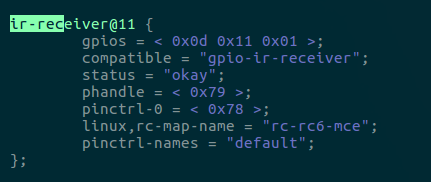
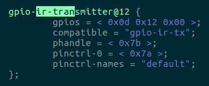
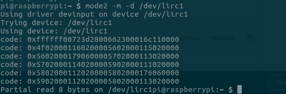
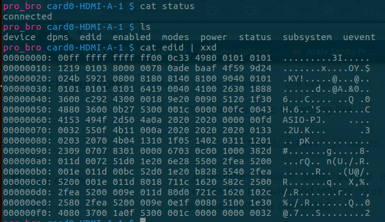
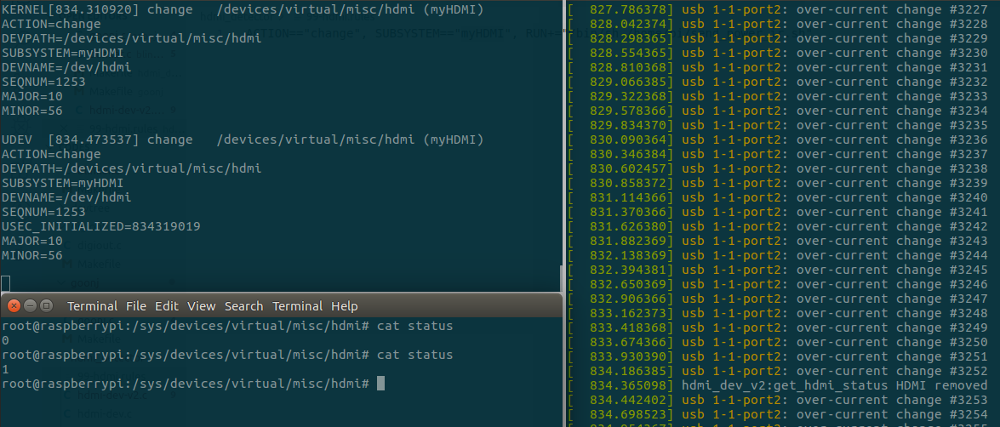

# ProjectorController9000

The objective of this experiment is to discard the laborious task of manually turning on/off a
projector when delivering presentations on a Raspberry Pi. The approach undertaken to automate
this is to catch HDMI connect/disconnect events and send appropriate signals to the projector
through an IR Transmitter. 

(Done as a part of VL 855 - Device Driver Development coursework at IIIT-B)

Preparation
===========

-   Installed LIRC packages on Raspbian Buster with kernel 4.19.75-v7+
    with a patch **[1]**.

-   Issued IR Emitter (IR333-A) and GPIO Utility Board with IR Receiver
    (TSOP1738).

-   Revised slides: part08-udev, part16-pin, part17-dts, part18-libgpio,
    part21-lirc.

Procedure and Test Cases
========================

-   Setup the IR Transmitter circuit; with a 5V source (in my case its
    from the RaspberryPi itself), a 400ohm resistor, a NPN transistor
    and an IR emitter (detailed schematic is given in
    [LIRC](#lirc) section).

-   Connect the RaspberryPi to a power source (in my case its a laptop)
    with the loaded modules ('ssh' with Ethernet cable could be used for
    debugging) and ensure the initial state of the whole setup is that
    the projector is ON and the HDMI cable is connected.

-   Ensure the IR emitter is directed towards the projector and there's
    no obstruction in-between.

-   The expected output is that once we disconnect the HDMI connector
    for the RaspberryPi, the IR emitter sends a POWER\_OFF signal (can
    be seen through a phone camera with no IR-filter) and the projector
    turns off after 3-4 secs (depends on polling frequency) of the
    disconnect event. In the case of plugging in the HDMI connector when
    the projector is OFF (red light), the IR emitter should send
    POWER\_ON signal and the projector should turn on in 3-4 secs.

Experiments and Analysis
========================

GPIO
----

"GPIO is half-baked hardware\" - with this statement in my head, I set
out to discover how one can setup functions for a GPIO cell to act like
an IR receiver and a transmitter. I figured de-compiling the device-tree
(which is currently being used by the kernel) to check for overlays that
have defined the GPIO pin numbers for IR-rx and IR-tx could be a valid
approach.

```$ sudo dtc -I fs /sys/firmware/devicetree/base -O dts -o loaded\_device\_tree.dts```
saved my de-compiled device-tree in 'loaded\_device\_tree.dts'. There I looked for ir-rx and ir-tx which gave me:





Here, we can see that receiver is to be connected to GPIO 17 (0x11) and
emitter at GPIO 18 (0x12). The same information is available in
```/boot/overlay/README``` (under gpio-ir and
gpio-ir-tx). Although to enable infrared communication and for the
overlay to take reflect in the device-tree, one had to uncomment a few
lines in ```/boot/config.txt``` (and then reboot for the
new device-tree to be picked up by the kernel) as shown here:


I also examined the description of the device-tree bindings
**[2]** **[3]** for more clarity on how the IR rx and tx
works before proceeding with the practical experiments.

LIRC
----

I, first, set up the initial circuitry composed of only the IR rx to
decode the 38KHz infrared signals from the CASIO projector's remote
using lircd daemon. I noticed the device special file created by LIRC
driver: ```/dev/lirc0``` (Tx) and
```/dev/lirc1``` (Rx) were exposed in devfs, as
discussed in the class. To see the receive raw (pulse-space) codes from
the remote, I used the command line utility provided by LIRC:
```mode2```. Although, that didn't work as expected even
after numerous tries and re-reading the man pages. The output I was
getting were decoded keycodes which were also different everytime even
for the same button press, as shown here:



This diverted my attention towards other utilities provided by LIRC;
```irrecord```, after it directed me to a database of
remotes with their corresponding keycodes **[4]** to an unfruitful
search, also proved to be erroneous because after recording KEY\_POWER
for the CASIO projector's remote, my keycode didn't match with my
colleagues' keycodes for the same button! This threw me off to use
```ir-ctl``` which after reading the man pages revealed
that it could be used to do both rx and tx but with raw IR codes! So,
the lircd daemon was no use in this case since I didn't have to decode.

```$ ir-ctl -1 - -receive=KEY\_POWER.txt -d/dev/lirc1``` 
was used to receive the raw codes of the
POWER button and save it in the KEY\_POWER.txt file.\
After this, testing of the rx part was done successfully. Before delving
into the circuitry of the tx part, I was warned by my colleague Shivam
to use a transistor to amplify the current supplied to the IR emitter
such that its able to send the infrared signals to the projector with
high-enough amplitude. Keeping this in mind the schematic of the circuit
is given below:


```$ ir-ctl - -send=KEY\_POWER.txt -d /dev/lirc0``` was
used to emit the raw codes of the POWER button saved in the
key\_power.txt file. This completes my testing of tx part as well. Now,
I just had to devise a solution to the question "When do I send the
POWER signal to the projector?\"

Mailbox
-------

Unaware of the presence of Broadcom VideoCore VI processor on my
Raspberry Pi Model 2B which handles the detection of HDMI instead of the
ARM Cortex-A7 processor, I hypothesised that the HDMI event detection
mechanism incorporated by my HP Pavilion 15 laptop should be the same in
case of the Raspberry Pi. With this assumption, I carried out some
unnecessary but enlightening experiments involving the 'drm' subsystem.
It had a device in sysfs named under
```card0-HDMI-A-1``` which had exposed attributes on the
state of HDMI connection, device-specific information in EDID (Extended
Display Identification Data) **[5]** format, etc (see figure
below).



This gave me an illusion on the complexity of the project in Raspberry
Pi. This illusion was erased once I re-read the problem statement and
discovered the absence of the 'drm' subsystem in RaspberryPi. But,
borrowing ideas from the above experiment, I used the EDID format to
detect the presence of an HDMI connect/disconnect event which I shall
discuss in the report later.

Mentioned in the hints, I turned my attention towards using 'tvservice'
and investigated how it uses Mailbox, an inter-processor communication
mechanism between the ARM core and the VideoCore, to detect the state of
HDMI connection when one uses the command-line utility: ```$ tvservice
-s``` or ```$ tvservice -M```. Upon
reading the source code **[6]**, I stumbled upon the different values
(bitmask) the state can take. This proved to be useful in deciphering
what the state code meant when one executed ```$ tvservice
-s```. Although, I wasn't able to trace how
'tvservice' uses the Mailbox channels for the communication. Surfing
through the 'userland' repository, I found the source code for
'vcmailbox' **[7]** utility. This had evident traces of how it uses the
Mailbox1 (ARM to VC) to send request on channel 8 (search for
MBOX\_CHAN\_PROPERTY) with property tags and how the response is
received on Mailbox0 (VC to ARM) in the same buffer, which is in sync
with the documentation **[8]**. I even tried out a few examples by
using the command-line utility ```$ /opt/vc/bin/vcmailbox
\[words\]``` and tried to exercise the same code as
this **[9]**. This was too tedious when I tried to request EDID blocks
with the property 'Get EDID Block' as mentioned here **[10]** as I
got confused on request format. This is when my colleague Vijay
suggested me to use Mailbox utility from kernel-modules **[11]**!
This seemed like a more reasonable approach as this would be a
kernel-space-based solution rather than a user-space one, where one
would ideally just write a 'bash' script to continuously poll over
tvservice's utility.

Tracing the source code **[12]** **[13]** **[14]**, the whole
communication interface between ARM and VC was much clearer. All I had
to do now was write a miscellaneous device module which exposes an
attribute called 'status' which, when read, sends a 'Get EDID Block'
request to VC over the mailbox channel and with some further logic
(discussed later) tells us if HDMI is connected or not. I used this
approach (of exposing an attribute) for testing purposes and I soon
realised how an 'uevent' mechanism would be much structured in this
case.

uevents
-------

On my colleague Mohana's recommendation, I decided to look through the
source code for how one can generate 'uevents' from kernel modules
**[15]**. I devised a mechanism which generates a 'uevent' with CHANGE
action and under a defined "myHDMI\" subsystem whenever there is a
change in state of HDMI connection; disconnected to connected and
connected to disconnected. A corresponding .rules file was implemented
which executes my previous findings on matching with my generated
'uevent'; sending a POWER infrared signal using
```ir-ctl```.

hdmi\_dev.c - Misc Device
-------------------------

Inspired by goonj.c and blinker.c, I wrote a misc\_device module which
sets up a timer to send a 'Get EDID Block' request (with workqueues
because the requests are not atomic due to presence of locks **[16]**) to
VC through a mailbox channel at a pre-defined rate and detects state
change to generate an 'uevent' with some internal logic. The logic is
that, when no HDMI device is connected, the reponse by VC should not
contain any information to my request of 'Get EDID Block' and when some
HDMI device is connected, I get some device-related data. I encountered
a few errors involving devices which can send multiple blocks of data in
the request but those were cleared after a thorough read of the EDID
v1.3 (bytes 18 and 19 tell the EDID version) specification issued by
VESA **[17]** **[18]** which said that the 127th byte tells us about
the remaining extension blocks to come. Once I received all the EDID
extensions correctly, I used ```edidparser``` to make
sense of the received data which reflected the flawlessly execution of
my module.

HPD in HDMI
-----------

The above approach of using a mailbox channel become obsolete when I
discovered that GPIO 46 is connected to pin 19 (Hot Plug Detect) of the
HDMI connector **[19]** in Raspberry Pi Model 2B. I even traced the
lines in the schematic (page 2) **[20]** just to confirm! Upon learning
more on about the detection process **[21]**, it made a lot of sense for me
to take this approach rather than the EDID one because it's much more
"cleaner\" and that pin must be solely meant to do HDMI detection. With
this, I updated my hdmi\_dev-w-edid.c to hdmi\_dev\-w-gpio.c which uses the
```get\_gpio\_value()``` framework to read the level of
GPIO 46. The other logic remains the same. Note: It's not necessary to
use workqueues in this case although it made sense for me that a
separate kernel-thread does the polling for me rather than the kernel
module itself.

Modes in CASIO projectors
-------------------------

After numerous experiments, Mohana and I realised that the projector
stays in STANDBY mode when the RED light is displayed. At this state,
even if the HDMI connector is plugged in, it's not plausible to detect
if it has been plugged in (we are assuming the power is not let through
the connector). In response to this, I believe it's not possible to
switch ON the projector when HDMI cable is plugged in; it must already
be in state ON for it to detect the connection. This behaviour is not
seen in cases of Monitors. I even explored other options apart from
POWER signal like BLANK signal (puts the projector in low-power mode by
switching off the display) but then I realised I was diverting away from
the original problem statement.

Conclusion
==========

The output matched the expectation in the case of HDMI disconnect event
but not for the HDMI connect event because it does not seem possible to
know if the HDMI is connected when the CASIO projector is OFF. Although,
when the projector is ON and we plug in the HDMI connector, we can
detect it. Below is the output:\




This project educated me on how to look through source code to interpret
the author's intentions. It also enabled me to question my design
choices through-out the process for example: kernel-space-based solution
vs. user-space-based solution, misc\_device vs. platform\_device, the
polling time, etc.

References
==========

**[1]**  RaspberryPi.org-Forums,  “[stretch/buster]  using  lirc  with  kernel  4.19.x  and  gpio-ir.”  [Online].Available:  https://www.raspberrypi.org/forums/viewtopic.php?f=28&t=235256

**[2]**  SeanYoung,   “gpio-ir-tx.txt.”   [Online].   Available:https://github.com/torvalds/linux/blob/master/Documentation/devicetree/bindings/leds/irled/gpio-ir-tx.txt

**[3]**  SeanYoung.,   “pwm-ir-tx.txt.”  [Online].  Available:https://github.com/torvalds/linux/blob/master/Documentation/devicetree/bindings/leds/irled/pwm-ir-tx.txt

**[4]**  irrecord-remotes   database,   “lirc-remotes.”   [Online].   Available:https://sourceforge.net/p/lirc-remotes/code/ci/master/tree/remotes/

**[5]**  Wikipedia,   “Edid.”   [Online].   Available:https://en.wikipedia.org/wiki/ExtendedDisplayIdentificationData

**[6]**  RaspberryPi-userland,   “tvservice.c.”   [Online].   
Available:https://github.com/raspberrypi/userland/blob/master/hostapplications/linux/apps/tvservice/tvservice.c

**[7]**  RaspberryPi-userland.,  “vcmailbox.c.”  [Online].  Available:    https://github.com/raspberrypi/userland/blob/master/hostapplications/linux/apps/vcmailbox/vcmailbox.c

**[8]**  R.  firmware  wiki,   “Mailboxes  wiki.”  [Online].  Available:    https://github.com/raspberrypi/firmware/wiki/Mailboxes

**[9]**  AndrewFromMelbourne,    “serialnummailbox.c.”   [Online].   Available:https://github.com/AndrewFromMelbourne/raspiserialnumber/blob/master/serialnumbermailbox.c

**[10]**  R.   firmware   wiki,    “Mailbox   property   interface   -   edid.”   [Online].   Available:https://github.com/raspberrypi/firmware/wiki/Mailbox-property-interface#get-edid-block

**[11]**  RaspberryPi-documentation,“Mailboxusage.”[Online].Available:https://github.com/raspberrypi/documentation/tree/JamesH65-mailboxdocs/configuration/mailboxes#using-the-mailboxes-from-kernel-modules

**[12]**  elixir  bootlin,   “mailbox-controller.h.”  [Online].  Available:    https://elixir.bootlin.com/linux/latest/source/include/linux/mailboxcontroller.h#L117

**[13]**  elixir  bootlin.,   “raspberrypi.c.”  [Online].  Available:    https://elixir.bootlin.com/linux/latest/source/drivers/firmware/raspberrypi.c#L145

**[14]**  elixir bootlin,  “mailbox.c.” [Online]. Available:  https://elixir.bootlin.com/linux/latest/source/drivers/mailbox/mailbox.c#L53

**[15]**  ——,  “kobjectuevent.c.”  [Online].  Available:   https://elixir.bootlin.com/linux/latest/source/lib/kobjectuevent.c#L456

**[16]**  Cesati  and  Bovet,  “Ldd-3-workqueues.”  [Online].  Available:  https://www.oreilly.com/library/view/understanding-the-linux/0596005652/ch04s08.html

**[17]**  VESA,  “Edid  standard.”  [Online].  Available:http://read.pudn.com/downloads110/ebook/456020/E-EDID%20Standard.pdf

**[18]**  Miseli,  “Xorg  -  edid.”  [Online].  Available:   https://www.x.org/wiki/Events/XDC2007/Notes/Xorg2007-EDID-JMiseli.pdf

**[19]**  RaspberryPi-Forum,   “Detecting   if   hdmi   is   present.”   [Online].   Available:https://www.raspberrypi.org/forums/viewtopic.php?t=18292#p933055

**[20]**  RaspberryPi,  “Schematic  raspi  2b.”  [Online].  Available:   https://www.raspberrypi.org/app/uploads/2012/04/Raspberry-Pi-Schematics-R1.0.pdf

**[21]**  datapro.net,  “Hpd,  ddc  and  edid.”  [Online].  Available:   https://www.datapro.net/techinfo/hotplugdetection.html10


